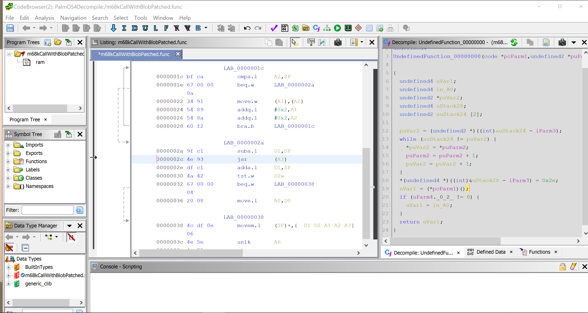

# Ghidra supports C output for uncommon architectures!

Since I wasnt able to find this out anywhere I just had to test it, so if you are waiting for C output for ROM hacking or emulator development, it exists right now its just not being talked about.
